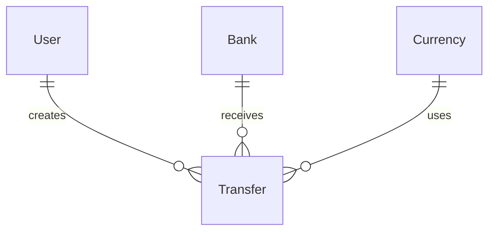

# Data Model: Bank Transfer Management System

**Feature**: Bank Transfer Management System  
**Date**: 2026-07-22  
**Status**: Complete

## Entity Relationships



## Entities

### User

Represents a system user with authentication credentials, profile information, and associated transfers.

**Fields**:
- `id` (UUID, PRIMARY KEY): Unique identifier for the user
- `username` (VARCHAR, UNIQUE): Unique username for login
- `email` (VARCHAR, UNIQUE): Email address for login and communication
- `fullName` (VARCHAR): User's full name
- `passwordHash` (VARCHAR): Bcrypt-hashed password (never store plain text)
- `createdAt` (TIMESTAMP): Account creation timestamp
- `updatedAt` (TIMESTAMP): Last profile update timestamp
- `lastLoginAt` (TIMESTAMP, NULLABLE): Last successful login timestamp

**Validation Rules**:
- `username`: 3-50 characters, alphanumeric with underscores and hyphens
- `email`: Valid email format, unique across all users
- `password`: Minimum 8 characters, must contain letters and digits
- `fullName`: 1-100 characters

**Indexes**:
- UNIQUE index on `username`
- UNIQUE index on `email`
- Index on `lastLoginAt` for recent activity queries

### Transfer

Represents a bank transfer request with beneficiary details, financial information, and status tracking.

**Fields**:
- `id` (UUID, PRIMARY KEY): Unique identifier for the transfer
- `userId` (UUID, FOREIGN KEY → User.id): User who created the transfer
- `beneficiaryName` (VARCHAR): Name of the transfer beneficiary
- `beneficiaryEmail` (VARCHAR): Email address of the beneficiary
- `iban` (VARCHAR): Full IBAN of the beneficiary account
- `bankName` (VARCHAR): Name of the recipient bank
- `amount` (DECIMAL): Transfer amount (precision: 19, scale: 4)
- `currency` (VARCHAR): Currency code (EUR, USD, CHF, CAD, GBP, PLN, RUB, etc.)
- `reference` (VARCHAR, NULLABLE): Optional reference or memo for the transfer
- `status` (ENUM): Transfer status - 'initiated' or 'rejected'
- `createdAt` (TIMESTAMP): Transfer creation timestamp
- `updatedAt` (TIMESTAMP): Last update timestamp
- `rejectedAt` (TIMESTAMP, NULLABLE): Timestamp when transfer was rejected
- `rejectionReason` (TEXT, NULLABLE): Reason for rejection if applicable

**Validation Rules**:
- `beneficiaryName`: 1-100 characters
- `beneficiaryEmail`: Valid email format
- `iban`: Valid IBAN format per ISO 13616 checksum algorithm
- `amount`: Must be greater than 0, maximum 999,999,999.9999
- `currency`: Must be one of supported currency codes
- `reference`: Optional, maximum 500 characters if provided
- `status`: Must be 'initiated' or 'rejected'

**State Transitions**:
- `initiated` → `rejected` (when user rejects the transfer)
- `rejected` → `initiated` (when user resets the status)

**Indexes**:
- INDEX on `userId` for user's transfer history
- INDEX on `createdAt` DESC for chronological ordering
- INDEX on `status` for filtering
- INDEX on `bankName` for bank filtering
- INDEX on `currency` for currency filtering
- COMPOSITE INDEX on `(userId, createdAt DESC)` for user history
- COMPOSITE INDEX on `(status, createdAt DESC)` for status-based queries
- COMPOSITE INDEX on `(bankName, status)` for bank+status filtering

### Bank

Represents a financial institution that can receive transfers.

**Fields**:
- `id` (UUID, PRIMARY KEY): Unique identifier for the bank
- `name` (VARCHAR): Bank name
- `country` (VARCHAR): Country code where bank is located
- `createdAt` (TIMESTAMP): Bank record creation timestamp

**Validation Rules**:
- `name`: 1-100 characters, unique across banks
- `country`: ISO 3166-1 alpha-2 country code (e.g., FR, DE, US)

**Indexes**:
- UNIQUE index on `name`
- INDEX on `country` for regional filtering

### Currency

Represents a supported currency for transfers.

**Fields**:
- `id` (UUID, PRIMARY KEY): Unique identifier for the currency
- `code` (VARCHAR, UNIQUE): ISO 4217 currency code (e.g., EUR, USD)
- `name` (VARCHAR): Full currency name
- `symbol` (VARCHAR): Currency symbol (e.g., €, $, £)
- `isActive` (BOOLEAN): Whether this currency is currently active

**Validation Rules**:
- `code`: 3-character ISO 4217 code, unique
- `name`: 1-50 characters
- `symbol`: 1-5 characters
- `isActive`: Boolean, defaults to true

**Indexes**:
- UNIQUE index on `code`
- INDEX on `isActive` for filtering active currencies

## Prisma Schema Definition

```prisma
model User {
  id           String    @id @default(uuid())
  username     String    @unique
  email        String    @unique
  fullName     String
  passwordHash String
  createdAt    DateTime  @default(now())
  updatedAt    DateTime  @updatedAt
  lastLoginAt  DateTime?

  transfers    Transfer[]

  @@index([username])
  @@index([email])
  @@index([lastLoginAt])
}

model Transfer {
  id              String    @id @default(uuid())
  userId          String
  beneficiaryName String
  beneficiaryEmail String
  iban            String
  bankName        String
  amount          Decimal   @db.Decimal(19, 4)
  currency        String
  reference       String?
  status          TransferStatus @default(initiated)
  createdAt       DateTime  @default(now())
  updatedAt       DateTime  @updatedAt
  rejectedAt      DateTime?
  rejectionReason String?

  user            User      @relation(fields: [userId], references: [id])

  @@index([userId])
  @@index([createdAt(sort: Desc)])
  @@index([status])
  @@index([bankName])
  @@index([currency])
  @@index([userId, createdAt(sort: Desc)])
  @@index([status, createdAt(sort: Desc)])
  @@index([bankName, status])
}

model Bank {
  id        String    @id @default(uuid())
  name      String    @unique
  country   String
  createdAt DateTime  @default(now())

  @@index([name])
  @@index([country])
}

model Currency {
  id       String   @id @default(uuid())
  code     String   @unique
  name     String
  symbol   String
  isActive Boolean  @default(true)

  @@index([code])
  @@index([isActive])
}

enum TransferStatus {
  initiated
  rejected
}
```

## Data Integrity Constraints

### Foreign Key Constraints
- `Transfer.userId` → `User.id` (CASCADE DELETE if user is deleted)
- All foreign keys must reference existing records

### Check Constraints
- `Transfer.amount` > 0
- `User.passwordHash` must be bcrypt hash format
- IBAN must pass checksum validation (application-level validation)

### Unique Constraints
- `User.username` must be unique
- `User.email` must be unique
- `Bank.name` must be unique
- `Currency.code` must be unique

## Security Considerations

### Sensitive Data Protection
- `User.passwordHash`: Never expose in API responses, always bcrypt
- `Transfer.iban`: Mask in UI views (show first 4 and last 4 characters only)
- `Transfer.rejectionReason`: May contain sensitive information, restrict access

### Data Retention
- Transfers must be retained for minimum 7 years per financial regulations
- Consider archival strategy for transfers older than 7 years
- User accounts should be retained even if inactive (for audit trail)

### Audit Trail
- All `createdAt` and `updatedAt` timestamps provide basic audit trail
- Consider adding `AuditLog` entity for sensitive operations (future enhancement)

## Performance Considerations

### Query Optimization
- Use composite indexes for common filter combinations
- Pagination for transfer history (default 20 per page)
- Consider materialized views for statistics aggregation
- Cache frequently accessed data (banks, currencies, user sessions)

### Partitioning Strategy (Future)
- Consider partitioning `Transfer` table by date for large datasets
- Archive old transfers to separate table or storage
- Implement data lifecycle management for 7+ year old records

## Migration Strategy

### Initial Migration
1. Create all tables with defined schema
2. Seed `Bank` table with common banks
3. Seed `Currency` table with supported currencies
4. Create admin user for initial system access

### Future Migrations
- Add new fields as needed (e.g., transfer categories, tags)
- Add indexes based on query performance analysis
- Implement partitioning when data volume grows
- Add audit logging if required by compliance
